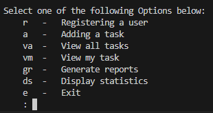
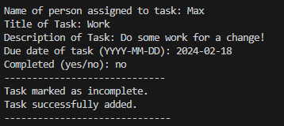
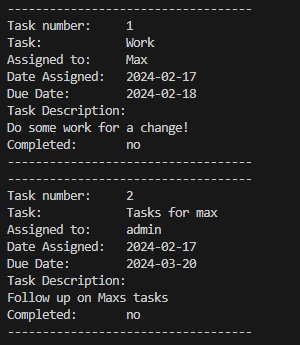
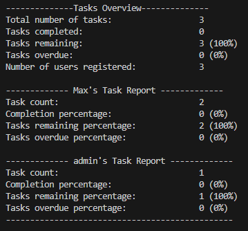

# Task Manager  

**Description:**  
The Task Manager is a Python-based application designed to help users manage tasks efficiently.  
- New users and tasks can be added  
- Tasks can be viewed and edited  
- Reports can be generated in `user_overview.txt` and `tasks_overview.txt`  
- Information in reports can be viewed  

This project provides a simple yet effective solution for organizing tasks, tracking progress, and analyzing task-related data.

**Table of Contents:**  
1. Installation  
2. Usage  
3. Credits  

**Installation:**  
To install and run the Task Manager locally, follow these steps:  
1. Clone the repository to your local machine.  
2. Ensure you have Python 3.x installed.  
3. Install any dependencies required by the application.  
4. Run the main script using `python task_manager.py`.  
5. Follow the on-screen instructions to log in and use the application.  

**Usage:**  
Once the Task Manager is running, you can perform the following actions:  
- Log in  
- **Menu:**  
    

- **Register User:**  
  Register with a unique username and password.  

- **Add Task:**  
  Add tasks, assign them to users, set due dates, and mark them as complete.  
    

- **View All Tasks:**  
  View all tasks stored in `tasks.txt`.  
    

- **View My Tasks:**  
  View tasks assigned to you specifically.  

- **Generate Reports:**  
  Generate reports summarizing task statistics for all users or individual users.  

- **Display Statistics:**  
  Display task statistics including total tasks, completed tasks, incomplete tasks, and overdue tasks for all users.  
    

**Credits:**  
This project was created by Max Griffiths.
